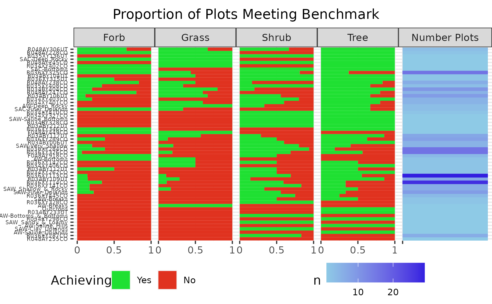

\pagenumbering{gobble}
\vspace{-1cm}

While each plant functions differently in an ecosystem context, the degrees of dissimilarity which exist between all species are unequal, allowing them to form natural groups. This observation has given rise to the notion of *Plant Functional Types*, shared attributes which unite similar species, and which bind how they affect ecosystems. Plant functional types are often the easiest form of vegetation data to measure, hence great amounts of work have been conducted on how they affect ecosystem function. 

In Western Colorado, four plant functional types are often used to evaluate rangeland conditions. These forms are: Trees, Shrubs, Grasses, and Forbs (or herbs), and each has been linked to affecting rangelands in multiple ways; theoretically their distributions and abundances are driven by variations in soil moisture throughout horizons (@sala199711). Accordingly, in nearly all instances a mix of each of these groups, less trees, is best to maintain ecosystem services on BLM Land. In the UFO which features extensive Pinon-Juniper Woodlands, trees when present, are included in this mix on ecological sites where they represent the climax vegetation community.

Semi-arid lands which are utilized as rangelands across the world are experiencing several common issues relating to shifts in the composition of their plant functional types (@archer2014ecosystem, @eldridge2016ecosystem, @maestre2016structure, @diaz2007plant, @dalgleish2010can). Namely, decreases in grasses whilst increases in woody species are occurring, and a decrease in the cover and number of species of perennial forbs while annual forbs increase (@diaz2007plant, @west2006long). In certain areas, the increases - or encroachment  of - woody species may be split into encroachment of trees, and the transition to a shrub state in ecological sites which do not support trees. 

The current increases in shrub cover relative to the cover of the herbaceous components of vegetation are problematic for a variety of reasons. The increase in trees within mixed grass-shrubland sites may decrease water available to grasses, forbs, and shrubs which favors non-native annual grasses (@mciver2022pinon), as domestic livestock and wildlife depend on palatable grasses, forbs, and shrubs these decrease the ability of our lands to support either. Increases in shrubs at the expense of perennial grasses and forbs may increase the severity of site level drought (@wilson2018functional), further shrubs and trees may foster higher severity fires. Increases in shrubs decrease soil stability, allowing increased erosion, increasing 'dust on snow', and poor air quality (@munson2011responses). Decreases in perennial grass may reduce competition with non-native annuals from overtaking sites @sheley2010resistance, @corbin2004competition, and a diversity of grass species may be the most effective prevention (@belnap2008soil). A decrease in forbs adversely affect wildlife both directly and indirectly, by decreasing the quality of habitats for species such as the Gunnison Sage-Grouse  (@pennington2016sagebrush). 

## Methods

Numerous inconsistencies exist between what the USDA Plants database species list classifies a shrub, sub-shrub, or forb relative to how ecological sites classify them into functional groups. These inconsistencies are permeated into the Colorado state species list utilized by AIM to calculate the plant functional group cover summaries. To appropriately compare conditions on the ground to ecological sites or ecological site groups we had to reassign certain plant species to the appropriate functional group. 

```{r setup, include=FALSE}
knitr::opts_chunk$set(echo = F)
knitr::opts_chunk$set(dpi = 300) 
knitr::opts_chunk$set(message = F)
knitr::opts_chunk$set(warning = F)
knitr::opts_chunk$set(fig.align="left") 
```

```{r import libraries}
library(tidyverse)
library(cowplot)
library(ggthemes)
library(hrbrthemes)
library(waffle)
library(sf)
library(kableExtra)

select <- dplyr::select
```

```{r Import AIM LPI Data}
praw <- '../data/raw'
ppro <-  '../data/processed'
f <- list.files(praw, pattern = 'csv')
files <- list.files(ppro, pattern = 'csv')

summary <- read.csv(file.path(praw, 'TerraDatVersionSummary.csv')) %>% 
  select(PrimaryKey, starts_with('AH'), Latitude_NAD83:Longitude_NAD83)

lpi <- read.csv( file.path(praw, 'LPIRAW.csv') ) %>% 
  select(PrimaryKey, RecKey, PointLoc:SoilSurface) %>% 
  mutate(across(.cols = TopCanopy:SoilSurface, ~ na_if(.x, ""))) %>% 
  pivot_longer(TopCanopy:SoilSurface, values_to = 'SYMBOL_AIM', names_to = 'Intercept') %>% 
  drop_na(SYMBOL_AIM) %>% 
  filter(SYMBOL_AIM != 'None', str_length(SYMBOL_AIM) >= 4)

```


```{r Calculate Individual Covers based on updated hits}

attributes <- read.csv(file.path(ppro, files[grep('Attribute.*Table-RCB', files)]) )
lpi_sub <-  left_join(lpi, attributes, by = 'SYMBOL_AIM', multiple = 'all') %>% 
  mutate(Intercept = factor(
    Intercept, c('TopCanopy', paste0(rep('Lower', 4), 1:4), 'SoilSurface'))) %>% 
  mutate(FUNCTIONAL2 = if_else(FUNCTIONAL == 'NonNoxSubShrubCover', 'NonNoxShrubCover', FUNCTIONAL)) %>% 
  group_by(PrimaryKey, RecKey, PointNbr, FUNCTIONAL2) %>% 
  slice_max(order_by = Intercept,  n = 1, with_ties = F) %>% 
  ungroup()

all_hits <- lpi_sub %>% 
  group_by(PrimaryKey, SYMBOL_USDA) %>% 
  add_count(SYMBOL_USDA, name = 'NIntercepts') %>% 
  select(PrimaryKey, SYMBOL_USDA, NIntercepts, SYMBOL_AIM, Intercept, FUNCTIONAL) %>% 
  distinct(PrimaryKey, SYMBOL_USDA, .keep_all = T)
  
all_hits_sum <- all_hits %>% 
  ungroup() %>% 
  group_by(PrimaryKey, FUNCTIONAL) %>% 
  summarize(Fractional_Cover = sum(NIntercepts)) 

all_hits_w <- all_hits_sum %>% 
  mutate(FUNCTIONAL = str_trim(FUNCTIONAL)) %>% 
  pivot_wider(names_from = FUNCTIONAL, values_from = Fractional_Cover, values_fill = 0) %>% 
  mutate(NoxSubShrubCover = 0, NoxSucculentCover = 0, NoxTreeCover = 0)  %>% 
  mutate(across(where(is.numeric), ~ (./150)*100))

rm(all_hits, all_hits_sum, lpi_sub)
```


```{r These are the Standards from TerraDat}

terradat_calc <- summary %>% 
  select(PrimaryKey, starts_with('AH')) %>% 
  pivot_longer(!PrimaryKey, names_to = 'Variable', values_to = 'Cover_TD') %>% 
  filter(Variable %in% c('AH_ForbCover', 'AH_GrassCover', 'AH_PerenGrassCover', 
                         'AH_ShrubCover', 'AH_PerenForbCover', 'AH_NonNoxTreeCover', 
                         'AH_PerenForbCover') ) %>% 
  mutate(Variable = str_remove(Variable, "AH_"),
         Variable = str_remove(Variable, "Cover"), 
         Variable = str_remove(Variable, "NonNox"))

rm(summary)
```

```{r Create compound metrics - ensure we are calculating values same as NOC team}

agg <- read.csv(file.path(praw, f[grep('Func_', f)]) ) %>% 
  filter(!FUNCTIONAL_AGGREGATE %in% c('PerenForb', 'PerenGrass'))

lpi_agg <- left_join(lpi, attributes, by = 'SYMBOL_AIM', multiple = 'all') %>% 
  mutate(Intercept = factor(
    Intercept, c('TopCanopy', paste0(rep('Lower', 4), 1:4), 'SoilSurface')),
    FUNCTIONAL = str_trim(FUNCTIONAL)) %>% 
  left_join(., agg, by = 'FUNCTIONAL') %>% 
  group_by(PrimaryKey, RecKey, PointNbr, FUNCTIONAL_AGGREGATE) %>% 
  slice_max(order_by = Intercept,  n = 1, with_ties = F) %>% 
  ungroup()

all_hits_agg <- lpi_agg %>% 
  group_by(PrimaryKey, SYMBOL_USDA) %>% 
  add_count(SYMBOL_USDA, name = 'NIntercepts') %>% 
  select(PrimaryKey, SYMBOL_USDA, NIntercepts, SYMBOL_AIM, Intercept, FUNCTIONAL_AGGREGATE) %>% 
  distinct(PrimaryKey, SYMBOL_USDA, .keep_all = T)
  
all_hits_agg_sum <- all_hits_agg %>% 
  ungroup() %>% 
  group_by(PrimaryKey, FUNCTIONAL_AGGREGATE) %>% 
  summarize(Cover_HB = sum(NIntercepts)) %>% 
  rename(Variable = FUNCTIONAL_AGGREGATE) %>% 
  mutate(across(where(is.numeric), ~ (./150)*100))

compare_agg <- inner_join(all_hits_agg_sum, terradat_calc, by = c('PrimaryKey', 'Variable')) %>% 
  mutate(across(where(is.numeric), ~ round(.x, 1)))

#FIX <- compare_agg %>% filter(Cover_HB != Cover_TD) %>% 
#  mutate(diff = abs(Cover_HB - Cover_TD))

off <- compare_agg %>% 
  rowwise %>% 
  filter(Cover_HB != Cover_TD) %>% 
  mutate(difference = abs(Cover_HB - Cover_TD))

pairs <- lapply(split(compare_agg, compare_agg$Variable), nrow) |> 
  data.frame()

all_cor <- lapply(split(compare_agg, compare_agg$Variable), 
       function(x) cor(x$Cover_HB, x$Cover_TD)) |>
  data.frame()

mismatch_cor <- lapply(split(off, off$Variable), 
       function(x) cor(x$Cover_HB, x$Cover_TD)) |>
  data.frame()

rm(agg, lpi_agg, all_hits_agg, all_hits_agg_sum)
```

```{r Create compound metrics plot, eval = F}

ggplot(data = compare_agg, aes(x = Cover_TD, y = Cover_HB)) +
  geom_point(shape = 1, color = "grey20") +
  labs(title = 'Validation of Calculations',
       x = 'TerrAdat (Standards)', y = 'In house') +
  facet_wrap(~ Variable) +
  theme_bw() + 
  theme(aspect.ratio = 1,
        panel.grid.minor = element_blank(),
        axis.text = element_text(color = "grey20", size = 8)) +
  xlim(0,101) + ylim(0,101) +
  scale_x_continuous(labels = paste0(seq(from = 0 , to = 100, by = 25), '%')) +
  scale_y_continuous(labels = paste0(seq(from = 0 , to = 100, by = 25), '%')) +
  geom_abline(intercept = 0, slope = 1, col = 'red')

ggsave(plot = last_plot(), device = 'png', height = 9, units = 'cm', 
       path = '../plots/graphics', filename = 'regression.png')
```

Very good agreement existed between our species reclassification summaries and TerrAdat plant functional group summaries (Figure 1), however outliers existed within the shrub and forb functional groups. Species outliers from Figure 1 were manually investigated for their functional classification in Ecological Sites and were reassigned.  A total of `r nrow(off) + nrow(compare_agg)` site functional group pairs were utilized for this process. By the end of the process  `r nrow(compare_agg)` of these pairs had identical values when rounded to 1 decimal point (a tenth of a percent), of the remaining `r nrow(off)` records, `r nrow(off[off$difference < 1,])` had less than a one percent difference in cover, and  `r nrow(off[off$difference < 1.5,])` were less than a 1.5% difference. By the end of the process the Pearson correlation coefficient for trees (n = `r pairs[1,'Tree']`, *r* =  `r round(all_cor[1,'Tree'], 5)`) and grass (n = `r pairs[1,'Grass']`, *r* =  `r round(all_cor[1,'Grass'], 5)`) indicated the values were essentially identical, and most likely diverged merely according to rounding during internal computations.  We further added the groups of Sedges (Cyperaceae), and Rushes (Juncaceae), into our calculations of grass cover. This is important as they are included in Interpreting Indicators of Rangeland Health (IIRH), and hence the ESD cover estimates, and are likely to be included in the ESG estimates. They are likely to make a notable difference in higher elevations sites, Mixed-Mountain Shrub & Aspen, where Elk Sedge (*Carex geyeri*) may be abundant. 

\begin{wrapfigure}{l}{0.27\textwidth}
  \centering
    \includegraphics[width=0.27\textwidth]{../plots/graphics/regression.png}
  \caption{Comparision of calculations}
\end{wrapfigure}

The difference between the remaining functional groups was greater due to whether a species was considered in one group or the other. For Forbs and Shrubs there was a consistent discrepancy regarding a single abundant species, *Gutierrezia sarothrae* (Broom Snakeweed). Based on a review of ESD’s, most authors considered this a sub-dominant shrub, a group which is combined into their estimates for Shrub Cover. Accordingly, we utilized this assessment of *Gutierrezia sarothrae* and included it as a shrub in our recalculations. As a result, we have a slightly larger discrepancy between our estimates and the TerrAdat estimate of shrub cover  (n = `r pairs[1,'Shrub']`, *r* = `r round(all_cor[1,'Shrub'], 5)`). Since many ecological sites also consider succulents, specifically the genus *Opuntia*, a shrub in their shrub cover estimates we also included it in our calculations of Shrub cover. This also leads to a discrepancy associated with estimates of forb cover  (n = `r pairs[1,'Forb']`, *r* = `r round(all_cor[1,'Forb'], 5)`). However, a greater number of values diverge between the TerrAdat summary of cover and our reclassified summaries, of the `r nrow(off)` records which diverge by > 0.1% cover, `r nrow(off[off$Variable=='Shrub',])` of them are associated with Shrubs, and the correlation here is much lower at *r* = `r round(mismatch_cor[1,'Shrub'], 5)`. We were unable to match up the functional groups from these two sources beyond this point.


```{r}
rm(off, compare_agg, mismatch_cor, all_cor, pairs, terradat_calc)
```


```{r Create the ESD style metrics with only NATIVES}

native_esd_grps <- read.csv( file.path(praw, f[grep('native_esd_covers', f)])) 

lpi_agg <- left_join(lpi, attributes, by = 'SYMBOL_AIM', multiple = 'all') %>% 
  mutate(Intercept = factor(
    Intercept, c('TopCanopy', paste0(rep('Lower', 4), 1:4), 'SoilSurface')),
    FUNCTIONAL = str_trim(FUNCTIONAL)) %>% 
  left_join(., native_esd_grps, by = 'FUNCTIONAL') %>% 
  group_by(PrimaryKey, RecKey, PointNbr, FUNCTIONAL_AGGREGATE) %>% 
  slice_max(order_by = Intercept,  n = 1, with_ties = F) %>% 
  ungroup()

all_hits_nat <- lpi_agg %>% 
  group_by(PrimaryKey, SYMBOL_USDA) %>% 
  add_count(SYMBOL_USDA, name = 'NIntercepts') %>% 
  select(PrimaryKey, SYMBOL_USDA, NIntercepts, SYMBOL_AIM, Intercept, FUNCTIONAL_AGGREGATE) %>% 
  distinct(PrimaryKey, SYMBOL_USDA, .keep_all = T)

all_hits_nat <- all_hits_nat %>% 
  ungroup() %>% 
  group_by(PrimaryKey, FUNCTIONAL_AGGREGATE) %>% 
  summarize(Cover_HB = sum(NIntercepts)) %>% 
  rename(Variable = FUNCTIONAL_AGGREGATE) %>% 
  mutate(across(where(is.numeric), ~ (./150)*100))

rm(attributes, native_esd_grps, lpi_agg, lpi)
```


```{r add 0 for functional groups missing from sites}

all_hits_nat <- all_hits_nat %>% 
  drop_na(Variable) %>% 
  group_by(PrimaryKey) %>% 
  pivot_wider(names_from = 'Variable', values_from = 'Cover_HB', values_fill = 0) %>% 
  pivot_longer(!PrimaryKey, names_to = 'Variable', values_to = 'Cover_HB')

```

 
```{r join site id to primarykeys}

pts <- st_read(
  '../../aimDB/data/raw/AIM_Sample_Design/AIM_Design_Stratification.shp',
                quiet = T) %>% 
  st_transform(26913) %>% 
  st_buffer(55) %>% 
  select(PLOTID, STRATUM) 

char <- read.csv(file.path(praw, f[grep('Characterization', f)] ) ) %>% 
  st_as_sf( coords = c('Longitude', 'Latitude'), crs = 4269) %>% 
  filter(str_detect(PrimaryKey, negate = T,
                    'Fuels|Bull-Draw|CO-NWD|_Tres_Rios|Grand_Junction|Gunnison|Moab|TRFO'),
         str_detect(PlotID, '[A-Z]{2,3}-[0-9]{2,3}')) %>% 
  st_transform(26913) %>% 
  select(PrimaryKey) 
  
esd_class <- read.csv( file.path(praw, f[grep('Tracking', f)]) ) %>% 
  filter(STATUS == 'SAMPLED') %>% 
  mutate(ECO.SITE = if_else(ECO.SITE.MATCHED == F, 'UNKNOWN', ECO.SITE)) %>% 
  select(PLOTID = PLOT.ID, ECO.SITE)

site_esd <- st_join(pts, char) %>% 
  drop_na(PrimaryKey) %>% 
  left_join(., esd_class, by = 'PLOTID') %>% 
  mutate(ECO.SITE = if_else(PLOTID == 'GR-035', 'R036XY114CO', ECO.SITE),
         PLOTID = if_else(PLOTID == 'GR-035', 'GR-025', PLOTID)) 

rm(pts, char, esd_class)
```


```{r import benchmarks and join homebrewed ESD groups to Ecological Site Descriptions}

benchmarks <- read.csv(file.path(praw, f[grep('Benchmark', f)])) %>% 
  select(-X, -RANGE)  %>% 
  mutate(SET = 'ESD')
esdM <- read.csv(file.path(praw, f[grep('modules', f)])) %>% 
  rbind(., data.frame(ESD = 'R036XY315UT',  
                      module_name = 'PinyonJuniper', 
                      module_number = 1))

# impute the value of lower benchmark for use with the ESG
bench_4for_besg <- benchmarks %>% # mean Estimate of ESD  
  filter(COVER_TYPE == 'Forb' & ESTIMATE == 'LOWER') %>% 
  summarize(mean = round(mean(COVER), 1)) %>% 
  as.numeric()

# repeat for ESG and combine
esg_lkp_tab <- read.csv(file.path(praw, f[grep('ESG-Lookup', f)]))

lkp_abb <- data.frame(
  Climate =
    c('Arid_Warm', 'Semiarid_Cool',  'Semiarid_warm', 'No_Climate_Group'),
  Abbrev = c('AW', 'SAC', 'SAW', "")
)

esg_cover <- read.csv(file.path(praw, f[grep('EcologicalSiteGroup', f)])) %>% 
  rowwise() %>% 
  mutate(Grass = sum(C3_Perennial_Grass, C4_Perennial_Grass)) %>% 
  select(Climate, SoilGeomorphicUnits, Grass, Forb, Shrub, Tree) %>% 
  left_join(., lkp_abb) %>% 
  unite('ESG', c('Abbrev', 'SoilGeomorphicUnits'), sep = '-') %>% 
  select(-Climate) %>% 
  mutate(ESG = str_remove(ESG, '^-'), 
         ESG = str_replace(ESG, 'AW-Sandy_Bottoms', 'AW-Bottoms'),
         ESG = str_replace(ESG, 'SAC-Saline_Sandy_Loamy_Finer_Uplands', 
                           'SAC-Finer_Uplands')
         ) %>% 
  left_join(., esg_lkp_tab, multiple = 'all')

# make long to bind together, combine both esd names and esg names

benchmarks_known_esd <- esg_cover %>% 
  pivot_longer(cols = Grass:Tree, values_to = 'COVER', names_to = 'COVER_TYPE') 

benchmarks <- benchmarks_known_esd %>% 
  select(-ECO.SITE) %>% 
  rename(ECO.SITE = ESG) %>% 
  bind_rows(., benchmarks_known_esd) %>% 
  select(-ESG) %>% 
  mutate(ESTIMATE = 'LOWER', COVER_RANGE = 'ORIGINAL', 
         MEAN = as.numeric(COVER), SET = 'ESG')  %>% 
  filter(!ECO.SITE %in% benchmarks$ECO.SITE) %>% 
  bind_rows(., benchmarks) %>% 
  as.data.frame() 

benchmarks <- drop_na(benchmarks, ECO.SITE) %>% distinct()
# add in imputed forb value

esg_others <- benchmarks %>% filter(SET == 'ESG' & COVER_TYPE != 'Forb')
esd <- benchmarks %>%  filter(SET == 'ESD')

benchmarks <- benchmarks %>% 
  filter(SET == 'ESG', COVER_TYPE == 'Forb') %>% 
  mutate(COVER = bench_4for_besg)  %>% 
  bind_rows(., esg_others, esd)

rm(lkp_abb, esg_lkp_tab, benchmarks_known_esd, esg_others, esd, bench_4for_besg)
```

```{r combine dataset for comparisions}

esg_plots <- read.csv(file.path(praw, f[grep('ESG_unverified_plots', f)]) ) %>% 
  mutate(ESG = str_replace(ESG, '_-_', '-')) %>% 
  rename(PLOTID = 'PLOT.ID')

# we have to detect plots which were not correlated to an ESD, and need to
# use the ESG as a stand in for ecological site 
site_esg <- site_esd %>% 
  filter(ECO.SITE == 'UNKNOWN') %>% 
  select(-ECO.SITE) %>% 
  left_join(., esg_plots, by = 'PLOTID') %>% 
  rename(ECO.SITE = ESG) 
site_esd <- site_esd %>% 
  filter(!PLOTID %in% site_esg$PLOTID) %>% 
  bind_rows(site_esg, .) %>% 
  st_drop_geometry()

# this inner join is killing me, missing many GR- why ? leading 0's  ?

all_hits_nat <- full_join(site_esd, all_hits_nat, by = 'PrimaryKey', multiple = "all") %>% 
  mutate(ECO.SITE = str_replace(ECO.SITE, 'SAC-Loamy_Uplands', 'SAC-Finer_Uplands'),
         ECO.SITE = str_replace(ECO.SITE, 'SAW-Sandy_Uplands_and_Loamy_Uplands', 
                                'SAW_Sandy_&_Loamy'),
         ECO.SITE = str_replace(ECO.SITE, 'SAW-Shallow_and_Deep_Rocky', 
                                'SAW_Shallow_&_Rocky'), 
         ECO.SITE = str_replace(ECO.SITE, 'AW-Shallow',  'AW-Very_Shallow'),
         ECO.SITE = str_replace(ECO.SITE, 'SAW-Bottoms_and_Bottoms', 
                                'SAW-Bottoms_&_Bottoms')
         ) %>% 
  drop_na()

benchmarks <- benchmarks %>% 
  mutate(ECO.SITE = str_replace(ECO.SITE, 'SAW-Sandy_Uplands_and_Loamy_Uplands',
                                 'SAW_Sandy_&_Loamy'), 
         ECO.SITE = str_replace(ECO.SITE, 'SAW-Shallow_and_Deep_Rocky', 
                                'SAW_Shallow_&_Rocky'),
         ECO.SITE = str_replace(ECO.SITE, 'AW-Saline_Bottoms_and_Bottoms', 
                                'AW_Bottoms'),
         ECO.SITE = str_replace(ECO.SITE, 'SAW-Bottoms_and_Bottoms', 
                                'SAW-Bottoms_&_Bottoms')
         ) %>%
  distinct(.keep_all = T)

rm(site_esd, site_esg, esg_plots)
```

\vspace{40mm}

## Results & Discussion

\begin{center}
{\section{Forb Cover}}
\end{center}

```{r add weights to each functional group and plot owernship combo}

wghts <- read.csv( file.path(praw, f[grep('Weights', f)])) %>% 
  select(WghtPerPlot, STRATUM = Stratum, AoInference = Area)

all_hits_nat <- read.csv(file.path(praw, f[grep('Interence', f)])) %>% 
  select(PLOTID = Plot.ID, AoInference, xcoord, ycoord) %>% 
  right_join(., all_hits_nat, multiple = 'all') %>% 
  rowwise() %>% 
  mutate(STRATUM = str_remove(str_extract(PLOTID, '^.*-'), '-')) %>% 
  left_join(., wghts, by = c('STRATUM','AoInference'), multiple = "all")  %>% 
  mutate(AoInference = str_replace(AoInference, '-NM', '-NCA')) %>% 
  rename(COVER_TYPE = Variable) %>% 
  st_as_sf(coords = c('xcoord', 'ycoord'), crs = 4269) %>% 
  drop_na() %>% 
  mutate(ECO.SITE = str_replace(ECO.SITE, 'SAW-Outcrops', 'Outcrops'),
         ECO.SITE = str_replace(ECO.SITE, 'SAW-Bottoms', 'SAW-Bottoms_&_Bottoms')) 

# also add the MEAN for plotting purposes

#all_hits_nat <- benchmarks %>% 
#  select(ECO.SITE, COVER_TYPE, MEAN) %>% 
#  right_join(., all_hits_nat, by = c('ECO.SITE', 'COVER_TYPE')) %>% 
#  st_as_sf(coords = c('xcoord', 'ycoord'), crs = 4269) 

rm(wghts)
```

```{r add strata to points for evaluating shrub cover}

lc_lkp <- read.csv(file.path(praw, f[grep('landcover', f)]) ) 
r <- terra::rast('../../plot_post_stratification/data/processed/PredictedVegClass.tif')

pts <- all_hits_nat %>% 
  distinct(PLOTID, .keep_all = T) %>% 
  select(PLOTID) %>% 
  terra::vect() %>% 
  terra::project(terra::crs(r))

reclass <- terra::extract(r, pts, method = 'simple', bind = T) %>% 
 as.data.frame() %>% 
  mutate(lyr1 = case_when(
         PLOTID %in% c('PJ-143', 'PJ-153') ~ 4, 
         PLOTID %in% c('AS-002', 'AS-004') ~ 3, 
         PLOTID == 'MC-068' ~ 2,
         TRUE ~ lyr1))
         
all_hits_nat <- left_join(all_hits_nat, reclass, by = 'PLOTID', multiple = "all") %>% 
  left_join(., lc_lkp, by = c('lyr1' = 'layer'), multiple = "all") %>% 
  select(-lyr1) %>% 
  relocate(stratum, .before = geometry) %>% 
  st_as_sf() %>% 
  mutate(stratum = str_trim(stratum))

rm(r, pts, reclass, lc_lkp)
```


```{r calculate land meeting benchmark forb results}

# need to add MEAN to everything to rearrange axis on plots
all_hits_forb <- all_hits_nat %>% 
  filter(COVER_TYPE == 'Forb') 

bmf <- benchmarks %>% 
  distinct() %>% 
  filter(COVER_TYPE == 'Forb', ESTIMATE == 'LOWER') %>%
  rename('TARGET' = COVER) 

all_hits_forb <- left_join(all_hits_forb, bmf, by = c('ECO.SITE', 'COVER_TYPE'), multiple = "all") %>% 
  mutate(Meeting = if_else(Cover_HB >= TARGET, T, F))

forb <- spsurvey::cat_analysis(
  dframe = all_hits_forb, siteID = 'PLOTID', vars = 'Meeting',
  subpops = 'AoInference',  weight = 'WghtPerPlot', vartype = 'Local', conf = 80)

ahf <- select(all_hits_forb, 
       PLOTID, AoInference, Meeting, COVER_TYPE, ECO.SITE, WghtPerPlot ) 

rm(bmf)
```


```{r Benchmarks to Realized Forbs, eval = F}

benchmarks %>% 
  filter(COVER_TYPE == 'Forb', ECO.SITE %in% all_hits_forb$ECO.SITE) %>% 
  
  ggplot() +
  geom_jitter(data = all_hits_forb, height = 0.2,
              aes(x = Cover_HB, y = fct_reorder(ECO.SITE, MEAN)), alpha = 0.4) +
  geom_point(aes(x = COVER, y = fct_reorder(ECO.SITE, MEAN), color  = SET), 
            shape = 18, alpha = 0.8, size = 3) + #benchmarks here
  theme_bw() + # AIM data are here
  
  scale_color_manual('Benchmark', 
                     values = c("ESD" = '#860FAE', "ESG" = "#da008d")) +
  
  theme(plot.title = element_text(hjust = 0.5),
        panel.grid.major.y =  element_blank(),
        axis.text.y = element_text(size = 7, angle = 45), 
        aspect.ratio = 16/9,
        legend.position = 'bottom') +
  labs(title = 'Forb Cover',
       y = NULL, x = 'Percent') +
  scale_x_continuous(NULL, breaks = seq(from = 0, to = 25, by = 5), 
                     labels = paste0(seq(from = 0, to = 25, by = 5), '%'), 
                     limits = c(0,30))

ggsave(plot = last_plot(), device = 'png', height = 21, units = 'cm', 
       path = '../results/benchmarks', filename = 'forb_benchmark.png')

rm(all_hits_forb)
```


Benchmark forb cover is generally low across all Ecological Sites in the study area, with a maximum expected cover at any site of `r max(benchmarks[benchmarks$COVER_TYPE == 'Forb' & benchmarks$ESTIMATE == 'UPPER','COVER'])`% and the median of all mean values across all sites `r median(benchmarks[benchmarks$COVER_TYPE == 'Forb', 'MEAN'])`%. In general these estimates focus on perennial species, as after they germinate nearly all species will produce above ground biomass every year of their lives. Compared to annual forbs, which may not be apparent in drier years - and remain as seeds, and are known to have considerable variation in there year to year abundances as a response to precipitation. 

```{r}
forb_achieve <- forb[forb$Category == 'TRUE',]
fa <- forb_achieve[forb_achieve$Subpopulation == 'SampleFrame', c('Estimate.P', 'LCB80Pct.P', 'UCB80Pct.P')]
```

Across all BLM land which is not managed as an NCA, WSA, or ACEC, the estimate of the total amount of land which is achieving benchmarks is `r paste0(round(fa$Estimate.P, 1), '%')` (LCB = `r round(fa$LCB80Pct.P, 1)`%, UCB = `r round(fa$UCB80Pct.P, 1)`%), similar to the estimates for all ACEC-WSA areas  `r paste0(round(forb_achieve[forb_achieve$Subpopulation == 'ACEC-WSA', 'Estimate.P'], 1), '%')`, and the Dominguez-Escalente NCA `r paste0(round(forb_achieve[forb_achieve$Subpopulation == 'DE-NCA', 'Estimate.P'], 1), '%')`. Results for the Gunnison Gorge are much lower, none of the `r forb[forb$Subpopulation == 'GG-NCA' & forb$Category == 'Total', 'nResp']` sampled sites were meeting benchmarks, indicating none of the land is. That roughly only 1/3 of all BLM administered land is meeting these objectives was unexpected.

```{r}
rm(forb_achieve, fa)
```

While nearly all plants produce less above-ground biomass during drought, the largest reduction in forb cover may be due to natural and climate induced mortality of individuals and the lack of recruitment of perennial forbs from the soil seed bank which replenishes local populations (@eziz2017drought, @casper1996demographic @munson2022primary). In other words, many individual plants are dying, and new individuals are not being recruited from seed during the prolonged drought. The establishment of both long and short lived forbs seems hampered during drought periods, and it may take several years after the cessation of a drought for the cover of perennial forbs to return to pre-drought conditions (@anderson2001landscape). 

\begin{wrapfigure}{l}{0.5\textwidth}
  \centering
    \includegraphics[width=0.5\textwidth]{../results/benchmarks/forb_benchmark.png}
  \caption{Benchmarks and Observed Values}
\end{wrapfigure}

It is probable that short lived perennial forbs, which generally only live a total of 2-4 years past their germination (@dalgleish2010can), have widely decreased in areas during the drought (@torang2010linking, @anderson2001landscape). Many long-lived perennial forbs seem to generally persist for one to two decades (but up to four are noted), and once established (i.e. they reach reproductive maturity) are able to survive disturbances, such as drought (@treshow1974longevity, @lauenroth2008demography, @morris2008longevity). However, given the duration of the current drought, and the merely episodic periods of normal moisture (Section 6) it is possible many of the long lived perennials have suffered non-drought induced mortality. Because of these conditions forbs have not recruited individuals from the seed bank. Recovery of the above ground cover of both forms of perennial forbs may require periods of from 2-5 years, or more, in mesic habitats (@anderson2001landscape) and longer in xeric habitats (Figure 2).

Areas in the field office which may be the most affected by forb declines may be those ecological sites with inherently lower water holding capacity; such as those with skeletal soils, high clay content, and shallow depths to bedrock, e.g. Salt Desert and considerable portions of Pinyon-Juniper Woodland. Soil depth can be a highly influential factor on survival of perennial forbs during times of drought  (@davison2010demographic, @nicole2011interdependent). Accordingly, ecological sites supporting Wyoming Big-Sage, e.g. Gunnison Sage-Grouse habitat, are less affected due to greater soil depth and higher water holding capacity. When a lack of forbs is observed at these sites, is likely to be stemming from issues other than drought. 

Aspects regarding the nature of perennial forbs are discussed further in section 12, but given the timing of sampling relative to the drought (Section 6), these results are not surprising. A more worrisome metric would relate to the species composition of forbs which are present at plots, rather than collective cover of them during periods of drought. This is because forbs have been shown to recover after droughts, granted they are initially present in the soil seed bank, partially because they have seeds which tend to have strong longevity, and partially because most species can produce some seed even under adverse conditions (@laforgia2018seed, @loydi2021extreme). If these forbs are even present patchily throughout an area, than it appears secondary dispersal (e.g. movement of seeds by an animal) of their seeds will allow a number of them to reach suitable micro-sites for possible reestablishment of individuals and then a population under climatically favorable conditions (@olano2012soil). 

\begin{center}
{\section{Woody Plant Encroachment}}
\end{center}

The cover of woody plants, both shrubs and trees, is observed to be at the upper end or beyond the reference benchmark values for cover at nearly all Ecological Sites (Figure 3 & 4). Greater cover of woody plants relative to reference condition is a common occurrence in nearly all arid and semi-arid rangelands globally (@bestelmeyer2018grassland, @archer2017woody). While some disagreement over the exact mechanistic causes of increases in woody plant cover exist in the literature, commonly attributed causal factors include: 1) An altered fire-cycle, 2) increasing atmospheric CO~2~, 3) improper grazing by livestock  (@bestelmeyer2018grassland). These initial drivers may lead to feedback loops enforced by changes to soil fertility which cause the shrub and or tree-encroached status of these sites to perpetuate (@bestelmeyer2018grassland).

Drought and insect induced mortality in Sagebrush and Pinyon-Juniper woodland ecological sites have been locally apparent in the field office, and across the Southwest, over the last 20+ years (@gaylord2013drought, @floyd2009relationship). Where mortality has occurred it threatens to create conditions which allow for high severity wildfire or diminished ecological function (@baker2004fire). While the species of shrubs and trees which grow in semi-arid lands are considered less responsive to droughts than forbs and grasses, due to depths which many of their roots are able to reach to draw soil moisture, drought predisposes them to insect induced mortality and die back (@gaylord2013drought, @winkler2019shrub). Shrubs and trees are considerably longer lived than either forbs and grasses, and recruitment of these species are limited during dry periods, the effects of background mortality on plant cover is likely to have only marginal effects at the time scales over which the current drought is occurring, and current reductions are likely to be the direct results of drought (@shinneman2009historical). 

Areas with dense stands of similarly aged trees are likely to experience high mortality due to a lack of self thinning processes and the competition between densely colonizing trees for limited water (@baker2004fire). These dense stands are often times the result of historic vegetation treatments, or other severe disturbances which led to a very large cohort of shrub and trees species germinating and attempting to develop simultaneously. Given the high density of these individuals and the long time which it takes for them to decompose, if a source of ignition occurs these areas are likely to allow fires to spread rapidly and burn 'hot'. Conditions which lead to wildfire's which are difficult to manage. 

We suspect that ecological sites which are being encroached upon by Pinon-Junipers, will have more mortality than those sites, which have them as the climax vegetation. It has been observed that their encroachment more commonly occurs at the lower elevation sage-brush sites, than mixed-mountain sites. Since the sage-brush habitat is generally closer to human habitations, and important for sage-grouse, these areas represent those which funding and management efforts can be focused towards. Further, as few of the sage-brush species resprout, fires can have longer lasting impacts there than in several other areas.

\vspace{5mm}

\begin{center}
{\section{Shrub Cover}}
\end{center}

```{r calculate land meeting benchmark shrubs results}

all_hits_shrub <- all_hits_nat %>% 
  filter(COVER_TYPE == 'Shrub') 

# restart here need to SPLIT THESE OUT INTO TWO DIFFERENT DATA FRAMES. WE NEED THE LOWER
# FOR THE SALT DESERT SITES !!!!!!!!!!!!!!!!!! UPPER FOR THE OTHER SITES!!!!!!!!

bm_sd <- benchmarks %>% 
  filter(COVER_TYPE == 'Shrub', ESTIMATE == 'LOWER')
  
salt_des_shrub <- all_hits_shrub %>% 
  filter(stratum ==  'Salt_Desert') %>% 
  left_join(., bm_sd, by = c('ECO.SITE', 'COVER_TYPE'), multiple = "all") %>% 
  mutate(Meeting = if_else(stratum ==  'Salt_Desert' & Cover_HB >= COVER,  T, F))

bmf <- benchmarks %>% 
  filter(COVER_TYPE == 'Shrub', ESTIMATE == 'UPPER' | SET == 'ESG') 

all_hits_shrub <- all_hits_shrub %>% 
  filter((stratum != "Salt_Desert")
         %>% replace_na(TRUE)) %>% 
  left_join(., bmf, by = c('ECO.SITE', 'COVER_TYPE'), multiple = "all") %>% 
  mutate(Meeting = if_else(Cover_HB <= COVER,  T, F)) %>% 
  bind_rows(., salt_des_shrub) %>% 
  rename('TARGET' = COVER) 

shrub <- spsurvey::cat_analysis(
  dframe = all_hits_shrub, siteID = 'PLOTID', vars = 'Meeting',
  subpops = 'AoInference',  weight = 'WghtPerPlot', vartype = 'Local', conf = 80)

ahs <- select(all_hits_shrub, 
       PLOTID, AoInference, Meeting, COVER_TYPE, ECO.SITE, WghtPerPlot) 

rm(bmf, salt_des_shrub, bm_sd)
```


```{r Benchmarks to Realized Shrubs, eval = F}

benchmarks %>% 
  filter(COVER_TYPE == 'Shrub', ECO.SITE %in% all_hits_shrub$ECO.SITE) %>% 

  ggplot() +
  geom_jitter(data = all_hits_shrub, height = 0.2,
              aes(x = Cover_HB, y = fct_reorder(ECO.SITE, MEAN)), alpha = 0.4) +
  geom_point(aes(x = COVER, y = fct_reorder(ECO.SITE, MEAN), color  = SET), 
            shape = 18, alpha = 0.8, size = 3) + #benchmarks here
  theme_bw() + # AIM data are here
  
  scale_color_manual('Benchmark', 
                     values = c("ESD" = '#F09D51', "ESG" = "#F06543")) +
  theme(plot.title = element_text(hjust = 0.5),
        panel.grid.major.y =  element_blank(),
        axis.text.y = element_text(size = 7, angle = 45), 
        aspect.ratio = 16/9,
        legend.position = 'bottom') +
  labs(title = 'Shrub Cover',
       y = NULL, x = 'Percent') +
  scale_x_continuous(NULL, breaks = seq(from = 0, to = 60, by = 10), 
                     labels = paste0(seq(from = 0, to = 60, by = 10), '%'), 
                     limits = c(0,60))

ggsave(plot = last_plot(), device = 'png', height = 21, units = 'cm', 
       path = '../results/benchmarks', filename = 'shrub_benchmark.png')

rm(all_hits_shrub)
```

```{r}
shrub_achieve <- shrub[shrub$Category == 'TRUE',]
sh <- shrub_achieve[shrub_achieve$Subpopulation == 'SampleFrame', c('Estimate.P', 'LCB80Pct.P', 'UCB80Pct.P')]
```

Across all BLM land which is not managed as an NCA, WSA, or ACEC, the estimate of the total amount of land which is achieving benchmarks is  `r paste0(round(sh$Estimate.P, 1), '%')` (LCB = `r round(sh$LCB80Pct.P, 1)`%, UCB = `r round(sh$UCB80Pct.P, 1)`%), similar to the estimate for the Gunnison Gorge NCA `r paste0(round(shrub_achieve[shrub_achieve$Subpopulation == 'GG-NCA', 'Estimate.P'], 1), '%')`. Both the ACEC-WSA areas  `r paste0(round(shrub_achieve[shrub_achieve$Subpopulation == 'ACEC-WSA', 'Estimate.P'], 1), '%')`, and the Dominguez-Escalente NCA `r paste0(round(shrub_achieve[shrub_achieve$Subpopulation == 'DE-NCA', 'Estimate.P'], 1), '%')`, had higher estimates of land meeting benchmarks, and the confidence intervals slightly overlapped the goal of having 80% of these lands being within the realm of natural variability, for this particular indicator. Accordingly overall, between one half and two thirds of all BLM lands were meeting this benchmark. 

```{r}
rm(shrub_achieve, sh)
```

We observed that despite the drought, and except for Salt Desert areas, nearly all plots across all Ecological Sites will have shrub covers exceeding the reference benchmarks (Figure 3). Further the extent of Ecological Sites which have elevated shrub cover are expected to be greater than for trees for multiple reasons. Chief among them are that, in the study area, shrubs have faster growth rates than trees, and a greater number of shrub species than trees species allow them to grow in more numerous habitat types. Further we expect that a great number of re-sprouting shrubs compose considerable amounts of this cover, in lieu of non-resprouting shrubs such as most of our species of sagebrush. 

Reductions in shrubby plant cover, while maintaining and enhancing other functional groups, is difficult to implement at a landscape scale, and success varies considerably by ecological site (@ding2022success). Accordingly, we expect that many areas of the field office which had been treated before the advent of the current Ecological Sites have already had shrub cover return. In shrub sites, like sagebrush, where non-woody shrubs species are now dominant restoration should emphasize reestablishing the balance in functional groups cover and composition while minimizing soil impacts due to erosion that has happened or may with soil disturbing approaches.

\begin{wrapfigure}{l}{0.5\textwidth}
  \centering
    \includegraphics[width=0.5\textwidth]{../results/benchmarks/shrub_benchmark.png}
  \caption{Benchmarks and Observed Values}
\end{wrapfigure}

This is the sole functional diversity metric which is computed in two manners. For sites which are in the Salt Desert stratum, per the spatial product created in (Section 2), we consider plots to be failing if they do not have cover of shrubs meeting the lower benchmark boundaries, and do not penalize sites which may have cover's exceeding the upper benchmark value. For sites outside of the salt desert stratum, they are considered to be out of reference only if there observed covers exceed the upper benchmarks. 

Ecological sites where shrubs are greatly reduced i.e. Salt Desert ecological sites, especially areas which have historically been composed primarily of shadscale (saltbush) (*Atriplex* spp.), require restoration by re-introducing more shrubs. Cover of most palatable species of shrubs, especially winterfat (*Krascheninnikovia*) & sages (*Artemisia*), in these areas was greatly reduced by improper livestock utilization upwards of a century ago (@Blaisdell_1984). While passive efforts have been made to facilitate the establishment of shrubs at these sites, the very slow re-generative process, combined with invasive annuals, climate and seasonal effects on usage, have not always shown the desired results (@jonas2018restoration). 

The recruitment of many species of shrubs in arid and semi-arid environments has been observed to be rare and episodic, requiring periods of above average precipitation for several consecutive years (@ackerman1979germination, @meyer2005factors). Further, reductions in shrubs, and minor endeavors of assisted migration are being explored. The central idea behind this is that the velocity required by a species to track climatically optimal habitat is greater than there propagules can move, especially given fragmented habitats which reduce the connectivity of natural lands (@loarie2009velocity, @meyer2005factors, @corlett2013will).

\newpage

\begin{center}
{\section{Tree Cover}}
\end{center}

```{r calculate land meeting benchmark tree results}

all_hits_tree <- all_hits_nat %>% 
  filter(COVER_TYPE == 'Tree')

bmf <- benchmarks %>% 
  filter(COVER_TYPE == 'Tree', ESTIMATE == 'UPPER' | SET == 'ESG') %>%
  rename('TARGET' = COVER) 

all_hits_tree <- left_join(all_hits_tree, bmf, by = c('ECO.SITE', 'COVER_TYPE'), 
                           multiple = "all") %>% 
  mutate(Meeting = if_else(Cover_HB <= TARGET, T, F))

tree <- spsurvey::cat_analysis(
  dframe = all_hits_tree, siteID = 'PLOTID', vars = 'Meeting',
  subpops = 'AoInference',  weight = 'WghtPerPlot', vartype = 'Local', conf = 80)

aht <- select(all_hits_tree, 
       PLOTID, AoInference, Meeting, COVER_TYPE, ECO.SITE, WghtPerPlot) 

rm(bmf)
```


```{r Benchmarks to Realized Trees, eval = F}

benchmarks %>% 
  filter(COVER_TYPE == 'Tree', ECO.SITE %in% all_hits_tree$ECO.SITE) %>%
  
  ggplot() +
  geom_jitter(data = all_hits_tree, height = 0.2,
              aes(x = Cover_HB, y = fct_reorder(ECO.SITE, MEAN)), alpha = 0.4) +
  geom_point(aes(x = COVER, y = fct_reorder(ECO.SITE, MEAN), color  = SET), 
            shape = 18, alpha = 0.8, size = 3) + #benchmarks here
  theme_bw() + # AIM data are here 
  scale_color_manual('Benchmark', 
                     values = c("ESD" = '#dd4513', "ESG" = "#2f4858")) +
  
  theme(plot.title = element_text(hjust = 0.5),
        panel.grid.major.y =  element_blank(),
        axis.text.y = element_text(size = 7, angle = 45), 
        aspect.ratio = 16/9,
        legend.position = 'bottom') +
  labs(title = 'Tree Cover',
       y = NULL, x = 'Percent') +
  scale_x_continuous(NULL, breaks = seq(from = 0, to = 40, by = 10), 
                     labels = paste0(seq(from = 0, to = 40, by = 10), '%'), 
                     limits = c(0,40))

ggsave(plot = last_plot(), device = 'png', height = 21, units = 'cm', 
       path = '../results/benchmarks', filename = 'tree_benchmark.png')

rm(all_hits_tree)
```

\begin{wrapfigure}{l}{0.5\textwidth}
  \centering
    \includegraphics[width=0.5\textwidth]{../results/benchmarks/tree_benchmark.png}
  \caption{Benchmarks and Observed Values}
\end{wrapfigure}

```{r}
tree_achieve <- tree[tree$Category == 'TRUE',]
tr <- tree_achieve[tree_achieve$Subpopulation == 'SampleFrame', c('Estimate.P', 'LCB80Pct.P', 'UCB80Pct.P')]
```

Across all BLM land which is not managed as an NCA, WSA, or ACEC, the estimate of the total amount of land which is achieving benchmarks is  `r paste0(round(tr$Estimate.P, 1), '%')` (LCB = `r round(tr$LCB80Pct.P, 1)`%, UCB = `r round(tr$UCB80Pct.P, 1)`%), similar to the estimate for the Dominguez-Escalente NCA `r paste0(round(tree_achieve[tree_achieve$Subpopulation == 'DE-NCA', 'Estimate.P'], 1), '%')`. Both the ACEC-WSA areas  `r paste0(round(tree_achieve[tree_achieve$Subpopulation == 'ACEC-WSA', 'Estimate.P'], 1), '%')`, and the Dominguez-Escalente NCA `r paste0(round(tree_achieve[tree_achieve$Subpopulation == 'GG-NCA', 'Estimate.P'], 1), '%')`, had higher estimates of land meeting benchmarks, and for the Gunnison Gorge the confidence intervals slightly overlapped the goal of having 80% of these lands being within the realm of natural variability, for this particular indicator. 

```{r}
rm(tree_achieve, tr)
```

The same general observations, trends, expectations, and reasoning behind an increase in tree cover is shared as discussed in the shrub section. Mortality of portions of trees is expected less on trees than shrubs.

Many historical Pinyon-Juniper vegetation treatments, were conducted throughout the study area (@pilliod2017seventy). However, akin to a great proportion of other such treatments globally, where the goal was to increase big game and livestock habitat, most of these were marginally effective (@ding2022success). This is likely due to the potential of those ecological sites not including a mixed grass-shrubland more desirable for livestock use. 

Currently three trajectories for Pinyon-Juniper cover exists in the study area. The **first** is the regrowth of Pinyon-Juniper on sites which were historically treated, and cannot support mixed grass-shrublands, and which are being allowed to naturally re-vegetate. The **second** is that a lack of certain disturbances, e.g. fire, at certain Ecological Sites is resulting in increases in Pinyon-Juniper as natural process of *succession*, i.e. these are parts of the landscape where the climax vegetation community is PJ, but which via management  may be kept in a grass-shrub condition. The **third** trajectory is that Pinon-Juniper are encroaching into ecological sites where trees are not expected due to the absence of naturally occurring processes, and are starting to promote their own expansions via feedback loops. In areas such as this multiple functionalities of the land are reduced, and are sites where vegetation treatments are highly desirable from a variety of ecosystem services perspectives (@yahdjian2015rangeland), and which are capable of regaining ground for wildlife and livestock usage (@anadon2014effect, @archer2017woody, @morford2022herbaceous).

The higher cover of trees than expected throughout the study area identifies ecological sites which vegetation treatments which involve tree removal can be implemented. Due to the effects of woody encroachment on the production of species which are used as forage by livestock, removals of low percentages of woody species at select ecological sites might have strong effects with minimal effort. Prioritization of sites where treatments will offer the most ecosystem services, such as the most productive sites in terms of forage production, and areas with species of wildlife which are susceptible to higher predation via tree encroachment. 

\newpage

\begin{center}
{\section{Perennial Grass Cover}} 
\end{center}

```{r calculate land meeting benchmark grass results}

all_hits_grass <- all_hits_nat %>% 
  filter(COVER_TYPE == 'Grass')

bmf <- benchmarks %>% 
  filter(COVER_TYPE == 'Grass', ESTIMATE == 'LOWER' | SET == 'ESG') %>%
  rename('TARGET' = COVER) 

all_hits_grass <- left_join(all_hits_grass, bmf, by = c('ECO.SITE', 'COVER_TYPE'), 
                            multiple = "all") %>% 
  mutate(Meeting = if_else(Cover_HB >= TARGET, T, F))

grass <- spsurvey::cat_analysis(
  dframe = all_hits_grass, siteID = 'PLOTID', vars = 'Meeting',
  subpops = 'AoInference',  weight = 'WghtPerPlot', vartype = 'Local', conf = 80)

ahg <- select(all_hits_grass, 
       PLOTID, AoInference, Meeting, COVER_TYPE, ECO.SITE, WghtPerPlot) 

rm(bmf)
```

```{r Benchmarks to Realized Grass, eval = F}

benchmarks %>% 
  filter(COVER_TYPE == 'Grass', ECO.SITE %in% all_hits_grass$ECO.SITE) %>% 
  
  ggplot() +
  geom_jitter(data = all_hits_grass, height = 0.2,
              aes(x = Cover_HB, y = fct_reorder(ECO.SITE, MEAN)), alpha = 0.4) +
  geom_point(aes(x = COVER, y = fct_reorder(ECO.SITE, MEAN), color  = SET), 
            shape = 18, alpha = 0.8, size = 3) + #benchmarks here
  theme_bw() + # AIM data are here
  
  scale_color_manual('Benchmark', 
                     values = c("ESD" = '#30A934', "ESG" = "#2f4858")) +
  
  theme(plot.title = element_text(hjust = 0.5),
        panel.grid.major.y =  element_blank(),
        aspect.ratio = 16/9,
        axis.text.y = element_text(size = 7, angle = 45), 
        legend.position = 'bottom') +
  labs(title = 'Grass Cover',
       y = NULL, x = 'Percent') +
  scale_x_continuous(NULL, breaks = seq(from = 0, to = 60, by = 10), 
                     labels = paste0(seq(from = 0, to = 60, by = 10), '%'), 
                     limits = c(0,60))

ggsave(plot = last_plot(), device = 'png', height = 21, units = 'cm', 
       path = '../results/benchmarks', filename = 'grass_benchmark.png')

rm(all_hits_grass)
```

\begin{wrapfigure}{l}{0.5\textwidth}
  \centering
    \includegraphics[width=0.5\textwidth]{../results/benchmarks/grass_benchmark.png}
  \caption{Benchmarks and Observed Values}
\end{wrapfigure}

```{r}
grass_achieve <- grass[grass$Category == 'TRUE',]
gr <- grass_achieve[grass_achieve$Subpopulation == 'SampleFrame', c('Estimate.P', 'LCB80Pct.P', 'UCB80Pct.P')]
```

Across all BLM land which is not managed as an NCA, WSA, or ACEC, the estimate of the total amount of land which is achieving benchmarks is  `r paste0(round(gr$Estimate.P, 1), '%')` (LCB = `r round(gr$LCB80Pct.P, 1)`%, UCB = `r round(gr$UCB80Pct.P, 1)`%). Results for the other areas, were comparable, but quite as low, with  Dominguez-Escalente NCA `r paste0(round(grass_achieve[grass_achieve$Subpopulation == 'DE-NCA', 'Estimate.P'], 1), '%')`. The ACEC-WSA areas `r paste0(round(grass_achieve[grass_achieve$Subpopulation == 'ACEC-WSA', 'Estimate.P'], 1), '%')`, and the Dominguez-Escalente NCA `r paste0(round(grass_achieve[grass_achieve$Subpopulation == 'GG-NCA', 'Estimate.P'], 1), '%')`. No confidence estimates for the amount of areas meeting benchmarks came close to meeting management objectives. 

```{r}
rm(tree_achieve, tr)
```

It is difficult to determine the extent to which grasses of the Colorado Plateau will reduce their above ground growth in response to drought. Various studies have found that grass production decreases during drought, and during periods of highly variable precipitation, however the extent of reductions are variable (@gherardi2015enhanced, @staver2019grazer, @munson2022primary). While other studies show that the amount of biomass produced by grasses is quite resilient to drought (@byrne2017contrasting), and that moisture limitation reductions in grass growth are largely buffered by legacy effects (in this case, a single normal year of precipitation, e.g. 2018, can offset the next few years of dryness and *vice versa*) (@sala2012legacies, @reichmann2013precipitation).  More recent studies on the Colorado Plateau have shown reduced growth of C4 grasses, partially due to variability in Monsoons, and C3 grasses via reduced cool season precipitation (@munson2022primary, @hoover2021drought). However, given the distinctive growth forms of grasses (i.e. generally columnar), it is unlikely that their cover would be found to be much lower via the methods employed by AIM, unless high levels of mortality occurred. 

Compared to perennial forb duration perennial grasses in general appear to live for considerably longer, many from 4-7 decades (@lauenroth2008demography, @treshow1974longevity) but many of the grasses in the sampling areas may only persist 1-1.5 decades. Many clonal (in particular rhizomatous & stoloniferous) grass species, such as some species of *Bouteloua* appear much less likely to undergo mortality of the whole plant (@de2010longevity) relative to bunch-grasses (but see @winkler2019shrub).  Mortality due to drought is expected to reduce cover measurements of grasses more than reductions in above ground biomass. While grasses tend to have deeper roots than forbs, soil textures and depths (@chamrad1965drought, @griffin2012mortality) still mediate drought effects. A manipulative experiment which sought to determine the effect of drought on five grass species in the Colorado Plateau observed mortality of roughly 25% of all individuals under the ambient treatment (similar conditions to what the UFO experienced), largely attributed to Indian Rice Grass (*Achnatherum hymenoides*), tracked in ambient conditions over the time period 2011-2018 (@winkler2019shrub). 

Similar to forbs, we expect little to none recruitment of new grass individuals from the soil seed bank. However suspect it is unlikely that has considerably high a proportion of the members of this functional group would have died off over this period, independent of drought induced mortality (@morris2008longevity, @winkler2019shrub) as perennial forbs, and given their average rooting depths relative to forbs should be more drought tolerant (@sala199711). Accordingly we expect estimates of grass cover to be at the lowest end of the benchmarks. 

```{r remove some writing variables}
rm(all_hits_grass, all_hits_forb, all_hits_shrub, all_hits_nat, all_hits_tree, 
   all_hits_w, esdM, esg_cover, benchmarks)
```


```{sh, crop the images, eval = F}
cd ../results/benchmarks
mogrify -trim *.png
```

### Metrics Combined

{width=5%,height=5%}

Few clear trends emerge regarding which Ecological Sites are failing to meet certain benchmarks, and the relationships between the functional diversity benchmarks which they are no t meeting. It is evident that few plots in few Ecological Sites are meeting either forb of grass cover benchmarks, and the only Ecological Sites which appear notably different here are those with only a single plot which was sampled in them. In general most ecological sites were achieving benchmark goals for shrub and tree cover, with the few exceptions being ecological sites which lacked replicates. This illustrating a notion that woody encroachment is not a large issue in the area of analysis, but rather that the loss of non-woody species within the remaining inter-spatial areas is concerning. 

```{r prep real data for overall ESD conditions}

achieving <- bind_rows(ahf, ahs, aht, ahg) %>% 
  group_by(ECO.SITE) %>% 
  add_count(name = 'SAMPLE') %>% 
  mutate(SAMPLE = SAMPLE/4) %>% 
  rename('LIFEFORM' =  COVER_TYPE) %>% 
  mutate(ACHIEVING = if_else(Meeting == T, 'Y', 'N'))

rm(ahf, ahs, aht, ahg)
```

The feature engineered cover of a lower forb benchmarks are used across all plots in lieu of the mean values from ESG's, which we felt was too high of a value relative to the other forb benchmark values included in the Ecological Sites Descriptions. The use of the median value means that more plots are passing benchmark conditions, than were under the pure ESG schema (original results not pictured here).

```{r write out results of whether meeting benchmarks or not, eval= FALSE}

achieving %>% 
  select(PLOTID, AoInference, Meeting, CATEGORY = LIFEFORM, ECO.SITE) %>% 
  mutate(INDICATOR = 'FUNCTIONAL DIVERSITY', .before = 'CATEGORY') %>% 
  rename_with(toupper) %>% 
  mutate(across(.cols = everything(), toupper)) %>% 
  write.csv(., row.names = F, 
          '../data/processed/functional_diveristy_meeting_benchmarks.csv')

```

Each individual Ecological Site, or Ecological Group, varies in the proportion of all plots located in them which are within reference condition. Once a greater number of replicate plots are sampled per Ecological Site (see Figure XX, panel 5 *(right most)*), and combined with digitized management records, these data may form an approach towards understanding the resilience of different Ecological Sites in the UFO to management actions. The Ecological Sites are arranged via descending order of the total proportion of vegetation types and plots which are achieving benchmarks. These results currently largely reflect the 

```{r Overall Vegetation Benchmarks Chart Broken Down to ESD, eval = F}

yn <- achieving
yn <- yn %>% 
  add_count(ACHIEVING, name = 'dummy')  %>% 
  mutate(dummy = jitter( (dummy/4) / SAMPLE )) %>% 
  arrange(-dummy) 
yn_levls <- yn %>% 
  distinct(ECO.SITE) %>% 
  pull(ECO.SITE)
yn <- yn %>% 
  group_by(ECO.SITE) %>% 
  mutate(ECO.SITE = factor(ECO.SITE, levels = yn_levls), 
         PROP_ACHIEVE = sum(if_else(ACHIEVING == 'Y', 1, 0))/n())

sfm <- c('Y' = 'Yes', 'N' = 'No')
sfm_values = c('Y' = '#1FE032', 'N' = '#E0321F')
new_labels <- c('FORB' = 'Forb', 'GRASS' =  'Grass', 'SHRUB' =  'Shrub', 'TREE' =  'Tree')

p1 <- ggplot(yn, aes(y = fct_reorder(ECO.SITE, PROP_ACHIEVE), fill = ACHIEVING)) + 
  facet_wrap(~LIFEFORM, nrow = 1) + #, 
           #  labeller = as_labeller(new_labels)) +
  geom_bar(position = "fill", width = 1) +
  scale_fill_manual('Achieving', labels = sfm,
                    values = sfm_values) +
  theme_bw() + 
  theme(legend.position= 'none', 
        axis.text.y = element_text(color = "grey20", size = 5),
        panel.spacing = unit(0, "lines"), 
        plot.margin=grid::unit(c(0,0,0,0), "lines"),
        panel.border = element_rect(fill = NA, colour = NA)) +
  labs(x = NULL, y = NULL) +
  scale_x_continuous(labels = c(0, 0.50, 1), breaks = c(0, 0.5, 1)) +
  guides(fill = guide_legend(reverse = TRUE))

l1 <- cowplot::get_legend( ggplot(yn, aes(y = ECO.SITE, fill = ACHIEVING)) + 
  geom_bar(position = "fill", width = 1) +
  scale_fill_manual('Achieving', labels = sfm,
                    values = sfm_values) +
  theme(
    legend.position= 'bottom', 
    axis.text.y = element_text(color = "grey20", size = 3),
    legend.text=element_text(size = 8), 
    panel.spacing = unit(0, "lines"), 
    plot.margin=grid::unit(c(0,0,0,0), "lines"),
    panel.border = element_rect(fill = NA, colour = NA)) +
  guides(fill = guide_legend(reverse = TRUE))
)

yn$title <- 'Number Plots'
p2 <- ggplot(yn, aes(y = fct_reorder(ECO.SITE, PROP_ACHIEVE), x = 1, fill = SAMPLE)) +
  facet_grid(. ~ title) +
  geom_tile() +
  scale_fill_continuous('n', low="#8ecae6", high="#321FE0") +
  scale_x_continuous(labels = 0.5, breaks = 0.5) +
  labs(x = NULL, y = NULL) +
  theme_bw() + 
  theme(
    legend.position="none", 
    plot.title = element_text(hjust = 0.5),
    legend.text = element_text(size = 8), 
    plot.margin = grid::unit(c(0,0,0,-0.2), "lines"),
    axis.text.x = element_text(color = 'white'), #remove x axis labels
    axis.text.y = element_blank(),  #remove y axis labels
    axis.ticks.y = element_blank(),  #remove y axis ticks
    panel.border = element_rect(fill = NA, colour = NA)) 

l2 <- cowplot::get_legend ( ggplot(yn, aes(y = ECO.SITE, x = 1, fill = SAMPLE)) +
  facet_grid(. ~ title) +
  geom_tile() +
  scale_fill_continuous('n', low="#8ecae6", high="#321FE0") +
  theme(legend.position="bottom", 
        legend.text = element_text(size = 8)))

combineLegend <- plot_grid(l1, l2, nrow = 1, rel_widths = c(0.5, 0.5),
                                    rel_heights = c(0.6, 0.4))
plots <- plot_grid(p1, p2, rel_widths = c(0.81, 0.19))
plotLeg <- plot_grid(plots, NULL, combineLegend, NULL, rel_heights = c(1, 0.1, 0.01, 0.1), nrow = 4, ncol = 1)
plotLeg
title <- ggdraw() + 
  draw_label("Proportion of Plots Meeting Benchmark", size = 12)

f_plot <- cowplot::plot_grid(title, plotLeg, ncol = 1, rel_heights = c(0.1, 1))

save_plot('../plots/graphics/PropPlotsMeetBenchmarks.png', f_plot)

# rm(title, combineLegend, l2, l1, plots, plotLeg, p1, p2, yn, sfm, sfm_values,
 #   new_labels, yn_levls, f_plot)
```

We can combine the number of plots, and their weight acres, within each stratum which had all four major functional groups within reference to develop a sense of how well the RMP objectives are being meet (Figure 6). 

```{r calculate areas meeting standards by STRATUM}

lc_lkp <- read.csv(file.path(praw, f[grep('landcover', f)]) ) 
r <- terra::rast('../../plot_post_stratification/data/processed/PredictedVegClass.tif')

pts <- st_read(
  '../../aimDB/data/raw/AIM_Sample_Design/AIM_Design_Stratification.shp',
                quiet = T)  %>% 
  select(PLOTID) %>% 
  terra::vect() %>% 
  terra::project(terra::crs(r))

reclass <- terra::extract(r, pts, method = 'simple', bind = T) %>% 
 as.data.frame() %>% 
  mutate(lyr1 = case_when(
         PLOTID %in% c('SS-313-', 'PJ-143', 'PJ-153', 'PJ-164', 'SS-313') ~ 4, 
         PLOTID %in% c('AS-002', 'AS-004', 'MMS-097') ~ 3, 
         PLOTID %in% c('MC-068', 'AS-012') ~ 2, 
         PLOTID %in% c('SS-306') ~ 6,
         TRUE ~ lyr1)) 
         
achieving <- left_join(achieving, reclass, by = 'PLOTID', multiple = "all") %>% 
  left_join(., lc_lkp, by = c('lyr1' = 'layer'), multiple = "all") %>% 
  select(-lyr1) %>% 
  st_as_sf()

rm(r, pts, reclass, lc_lkp)

ach_forb <- filter(achieving, LIFEFORM == 'Forb')
ach_forb <- spsurvey::cat_analysis(
  dframe = ach_forb, siteID = 'PLOTID', vars = 'Meeting',
  subpops = 'stratum',  weight = 'WghtPerPlot', vartype = 'Local', conf = 80)  %>% 
  filter(Category == 'TRUE') %>% select(Subpopulation, Estimate.P)

ach_shrub <- filter(achieving, LIFEFORM == 'Shrub')
ach_shrub <- spsurvey::cat_analysis(
  dframe = ach_shrub, siteID = 'PLOTID', vars = 'Meeting',
  subpops = 'stratum',  weight = 'WghtPerPlot', vartype = 'Local', conf = 80)  %>% 
  filter(Category == 'TRUE') %>% 
  select(Subpopulation, Estimate.P)

ach_tree <- filter(achieving, LIFEFORM == 'Tree')
ach_tree <- spsurvey::cat_analysis(
  dframe = ach_tree, siteID = 'PLOTID', vars = 'Meeting',
  subpops = 'stratum',  weight = 'WghtPerPlot', vartype = 'Local', conf = 80)  %>% 
  filter(Category == 'TRUE') %>% 
  select(Subpopulation, Estimate.P)

ach_grass <- filter(achieving, LIFEFORM == 'Grass')
ach_grass <- spsurvey::cat_analysis(
  dframe = ach_grass, siteID = 'PLOTID', vars = 'Meeting',
  subpops = 'stratum',  weight = 'WghtPerPlot', vartype = 'Local', conf = 80) %>% 
  filter(Category == 'TRUE') %>%
  select(Subpopulation, Estimate.P)

waff_dat2 <- bind_rows(ach_forb, ach_shrub, ach_tree, ach_grass) %>% 
  mutate(Estimate.P =  round(Estimate.P, 0)) %>% 
  split(., .$Subpopulation) %>% 
  map(., . %>% arrange(-Estimate.P) %>% 
        mutate(estimate = factor(c('One', 'Two', 'Three', 'Four'))) %>% 
        
        # remove rows where the estimate is the same
        arrange(-Estimate.P, estimate) %>% 
        group_by(Estimate.P) %>%
        slice(1) %>% 
        ungroup() %>% 
        
        # create data regarding the number of land meeting no benchmarks
        bind_rows(., data.frame(
          Subpopulation = NA, 
          estimate = 'None', 
          Estimate.P = 100) 
          ) %>% 
        
       # arrange(estimate) %>% 
        mutate(diff = Estimate.P - lag(Estimate.P, default = first(Estimate.P))) %>% 
        mutate(estimate = factor(estimate, c('Four', 'Three', 'Two', 'One', 'None'))) %>% 
        fill(Subpopulation, .direction = 'down')
        ) %>%
  bind_rows() %>% 
  group_by(Subpopulation) %>% 
  arrange(estimate) 

waff_dat2 <- waff_dat2 %>%
  slice(1) %>% 
  mutate(diff = Estimate.P) %>% 
  bind_rows(., waff_dat2 ) %>% 
  group_by(Subpopulation, estimate) %>% 
  arrange(-diff) %>% 
  slice(1)

rm(ach_forb, ach_shrub, ach_tree, ach_grass)
```

```{r Overall Vegetation Benchmarks By Major Stratum, eval = F}

lkp <- data.frame(
  old = c('Sage_Brush', 'Salt_Desert', 'Mixed_Mountain_Shrub', 'Pinon_Juniper',
          'Aspen'), 
  Stratum = c('Sagebrush', 'Salt Desert', 'Mtn. Shrub',  'Pinon-Juniper', 'Aspen'),
  Prop_area = c(9, 18, 11, 61, 1)
)

waff_dat2 <- waff_dat2 %>% 
  mutate(Subpopulation = str_trim(Subpopulation) ) %>%
  left_join(., lkp, by = c('Subpopulation' = 'old')) %>% 
  filter(Stratum != 'Aspen') %>% 
  mutate(Stratum = factor(Stratum, levels = c('Sagebrush', 'Mtn. Shrub',
                                               'Salt Desert', 'Pinon-Juniper'))) %>% 
  select(Stratum, Estimate = estimate, Percent = diff, Prop_area) %>% 
  mutate(n = (Percent * Prop_area) / 10,
         n = n * 0.888)

waff_dat2 <- data.table::setorder(waff_dat2, Estimate)

zerofourPal <- c('None' = '#d7191c', 'One +' = '#fdae61', 'Two +' = '#ffffbf', 
                'Three +' = '#a6d96a', 'Four' = '#1a9641')
zerofourVal <- c('None' = '#d7191c', 'One' = '#fdae61', 'Two' = '#ffffbf', 
                'Three' = '#a6d96a', 'Four' = '#1a9641')

ggplot(waff_dat2, aes(fill = Estimate, values = n)) +
  geom_waffle(color = "white", size = .25, 
              flip = TRUE ) +
  facet_wrap(~ Stratum, nrow = 1, strip.position = "bottom") +
  
  scale_fill_manual('Condition:', values = zerofourVal,
                labels = c('Four', 'Three +', "Two +", 'One +', 'None')) +
  scale_x_discrete()  +
  scale_y_continuous(labels = function(x) x * 10000, # make this multiplyer the same as n_rows
                     expand = c(0,0))  +
  
  theme(
    axis.text.y = element_text(angle = 45, size = 8), 
    axis.text.x = element_text(size = 8), 
    legend.position="bottom",
    plot.title = element_text(hjust = 0.5, size = 11, face = 'bold'),
    panel.spacing = unit(0.01, "lines"), 
    strip.background =element_rect(fill="white"), 
    panel.background = element_blank(),
    legend.key.height = unit(1, 'lines'), #change legend key height
    legend.key.width = unit(0.5, 'lines'),
    legend.title = element_text(size=9),
    legend.text = element_text(size=7)
    )  +
  
   labs(title = "Areas meeting\nFunctional Cover Benchmarks", 
        y = 'Acres')

ggsave(plot = last_plot(), filename = '../plots/graphics/benchmark_areas.png', 
       width = 12, height = 10, units = "cm")

rm(lkp, waff_dat2, zerofourPal, zerofourVal)
```

```{r Total Area Meeting Benchmarks by Management Unit Table}

r <- bind_rows(
  cbind(Functional = 'Forb', forb),
  cbind(Functional = 'Grass', grass),
  cbind(Functional = 'Shrub', shrub),
  cbind(Functional = 'Tree', tree)
) %>% 
  group_by(Subpopulation, Functional) %>% 
  mutate(Plots = max(nResp)) %>% 
  filter(Category == TRUE) %>% 
  mutate(across(where(is.numeric), ~ round(.x, 1)))  %>% 
  arrange(Subpopulation, Functional) 
  

r1 <- r%>% 
  mutate(Land_Meeting = paste0('(', LCB80Pct.P, '-) ', 
                                  Estimate.P, '% (-', UCB80Pct.P, ")"), 
         Goal = rep()) %>% 
  select(Management = Subpopulation, Plots, Functional, Land_Meeting) 
```

```{r some writing metrics}

shrub1 <- shrub %>% 
  filter(Category == T) %>% 
  select(Subpopulation, LCB80Pct.P, Estimate.P, UCB80Pct.P)

acec_meet <- toString(
  paste0(
    round(shrub1[shrub1$Subpopulation == 'ACEC-WSA', 'LCB80Pct.P'], 1), '- ', 
    round(shrub1[shrub1$Subpopulation == 'ACEC-WSA', 'Estimate.P'], 1), '% -',  
    round(shrub1[shrub1$Subpopulation == 'ACEC-WSA', 'UCB80Pct.P'], 1) ) )

de_nca <- toString(
  paste0(
    round(shrub1[shrub1$Subpopulation == 'DE-NCA', 'LCB80Pct.P'], 1), '- ', 
    round(shrub1[shrub1$Subpopulation == 'DE-NCA', 'Estimate.P'], 1), '% -',  
    round(shrub1[shrub1$Subpopulation == 'DE-NCA', 'UCB80Pct.P'], 1) ) )

r <- r %>% 
  cbind(., Goal = c(rep(80, times = 12), rep(70, times = 4)))
```

\begin{wrapfigure}{r}{0.45\textwidth}
  \centering
    \includegraphics[width=0.45\textwidth]{../plots/graphics/benchmark_areas.png}
  \caption{Total area of each stratum and the overall status of benchmarks}
\end{wrapfigure}

Results by management areas in general do not differ greatly. From a broad perspective, roughly a quarter of lands in the field office is meeting standards for forb or grass cover, except for the Gunnison Gorge National Conservation Area which has no land meeting objectives for forb cover (Table 1). While there were relatively few plots sampled in the Gunnison Gorge NCA, **XX**, all plots sampled failed to achieve minimum benchmark cover values a result that is unlikely to be due to chance, as is reflected by the Areas of Critical Environmental Concern (Table 1). No areas are meeting the benchmarks for Tree cover either, although most management areas have roughly one half of their land achieving. 
  This indicates the need to explore tree thinning, or removal, operations in certain areas, as funding permits and needs require, to benefit wildlife via modification of habitat or to decrease the threats of wildfires to adjacent human population base (@baker2004fire, @shinneman2009historical). Given the historic reductions in fire cycle this is an issue which requires a great many decades before coming back into resolution, but given the current awareness of the problem, management actions are now underway which will do so. Roughly half to two-thirds of land are achieving shrub cover objectives, and two areas have confidence intervals which do (`r acec_meet`), of very nearly (`r de_nca`), include the land cover targets. 
  On the whole, the results taken together indicate that the study area is failing to meet metrics for plant functional diversity, with only areas `r filter(r, UCB80Pct.P > Goal) %>% nrow()` having confidence intervals which even overlap the management objectives. However, the perennial grass functional group presents the  most serious concern. The median estimate of land within any area meeting objectives for cover of perennial grasses is `r paste0(round( median(grass[grass$Category == TRUE,'Estimate.P']), 1), '%')`, across the entirety of the field office the estimate of lands meeting objectives for grasses is a low `r paste0(round(grass[grass$Category == TRUE & grass$Subpopulation == 'SampleFrame', 'Estimate.P'], 1), '%')`, the ^2nd^ lowest proportion of land out of all benchmarks and areas. 

\newpage 

```{r table metrics in numbers}

cname <- c('Goal', 'Management', 'Plots', 'Group', '% Land Meeting')

bind_cols(r1, Goal = 
            c(
              paste0(rep(80, times = 12), '%'), paste0(rep(70, times = 4), '%')
              )) %>%  
  relocate(Goal, .before = Management) %>% 
  knitr::kable(., align = c("c", "c", "c", "l", "c"),
               col.names = cname,
               booktabs = TRUE, linesep = "", 
               caption = "Land Meeting Benchmarks by Administrative Unit") %>% 
  kableExtra::collapse_rows() 

rm(r1, cname)
```

```{r}

achieving %>% 
  st_drop_geometry() %>% 
  select(PLOTID, AoInference, Meeting, CATEGORY = LIFEFORM, ECO.SITE) %>% 
  mutate(INDICATOR = 'FUNCTIONAL DIVERSITY', .before = CATEGORY) %>% 
  rename_with(toupper) %>% 
  mutate(across(.cols = everything(), toupper))  %>% 
  arrange(PLOTID) %>% 
  write.csv(., row.names = F, 
          '../data/processed/functional_diversity_meeting_benchmarks.csv') 

```

\newpage 

## References 

\small