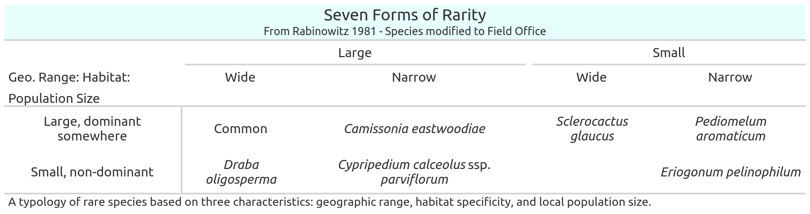

```{r setup, include=FALSE}
knitr::opts_chunk$set(echo = F)
knitr::opts_chunk$set(dpi = 300) 
knitr::opts_chunk$set(message = F)
knitr::opts_chunk$set(warning = F)
```

> _"Rarity is one of those concepts that suffuses our culture: it defies precise definition and when used by the scientist it is often given a spurious accuracy to satisfy our need for precision."_
>
> `r tufte::quote_footer('--- V.H. Heywood 1988')`

In general, a connotation where rare species are synonymous with legal protections exists in popular culture (@kruckeberg1985biological, @gaston1994rarity). However, rarity is the normal condition under which a vast multitude of species in all kingdoms of life exist, and only a subset of these species are at risk of extinction (@enquist2019commonness, @flather2007species). Rare species are inherently organisms which are difficult to detect in nature relative to other 'common' species (@rabinowitz1981seven), but see @kondratyeva2019reconciling for elaborations on rarity. One of the most consistently supported, both empirically and theoretically, observations in ecology is that the majority of species in any one location are represented by only a few individuals (@preston1948commonness, @stohlgren2005patterns, @manzitto2022most). 

Rare species encode enormous amounts of functional diversity to an area and have been shown in multiple cases to imbue an ability to respond to disturbance (@isbell2011high, @leitao2016rare, @mouillot2013rare, @oliver2015biodiversity). While we focus on large functional groups in SECTION XX, each of these groups has enormous variation within them, and due to the sheet number of rare species, they comprise most of the variation within these groups (@kondratyeva2019reconciling,  @mouillot2013rare). Rare species are also capable of reducing the possibility and severity of biological invasions (@lyons2001rare, @oakley2013plant). 

A popular conceptual framework to discuss these species may be considered which contains three dimensions, 1) the geographic expanse of the species, 2) their relative restriction to particular habitats, 3) and the number of individuals per population 'size' (@rabinowitz1981seven). Collectively the interaction between these traits can result in a matrix with eight cells along these axises (Table 1), seven of these cells being rare species, six of which occur more frequently (@rabinowitz1981seven). The rare species which receive most of the attention, are those which are restricted to particular habitats across narrow geographical extents, *'narrow (local) endemics'* (Table 1 & 2) (@kruckeberg1985biological). In general narrow endemics tend to be the species which require special legal protection to ensure their habitats undergo minimal alterations (@harnik2012long, AND AND ).  However, the remaining types of rarity still call for documentation by land management agencies. 

```{r Create Rabinowitz table, eval = F}
library(gt)

footnote = 'A typology of rare species based on three characteristics: geographic range, habitat specificity, and local population size.'

rabinowitz <- data.frame(
  rowname = c('Large, dominant somewhere', 'Small, non-dominant'),
  wide = c(
    'Locally abundant over large range in several habitats', 
    'Constantly sparse over large range in several habitats'), 
  narrow = c(
    'Locally abundant over large range in a specific habitat',
    'Consistently sparse in a specific habitat but over a large range'),
  wide1 = c(
    'Locally abundant in several habitats but restricted geographically',
    'Constantly sparse and geographically restricted in several habitats'),
  narrow1 = c(
    'Locally abundant in a specific habitat but restricted geographically',
    'Constantly sparse and geographically restricted in a specific habitat')
  )

rab_tab <- rabinowitz %>% 
  gt(rowname_col = "rowname") %>% 
  fmt_markdown(columns = everything()) %>% 
  tab_header(
      title = 'Seven Forms of Rarity',
      subtitle = 'From Rabinowitz 1981') %>% 
  cols_align(align = "center" ) %>% 
  cols_label(
      wide = "Wide",
      narrow = "Narrow",
      wide1 = "Wide",
      narrow1 = "Narrow") %>% 
  tab_spanner(
    id = 'test',
    label = 'Large',
    columns = c(wide, narrow)) %>% 
  tab_spanner(
    label = 'Small',
    columns = c(wide1, narrow1)) %>% 
  tab_stubhead('Geo. Range: Habitat:') %>% 
  tab_row_group(
    label = 'Population Size', 
    rows  = 1:2) %>% 
  tab_footnote(footnote) %>% 
  
  tab_options(heading.background.color = "#FFE6E9",
              row_group.border.top.color = "white", #e6fffc # maybe for the remaining lines?
              heading.border.lr.color='white', 
              column_labels.border.top.color = "white",
              table.border.top.color = "white",
              table.border.bottom.color = "white",
              table_body.hlines.color = "white",
              heading.padding = 0,
              row_group.padding = 0)

gtsave(rab_tab, "../results/rab_tab.png")

rabinowitz_examples <- data.frame(
  rowname = c('Large, dominant somewhere', 'Small, non-dominant'),
  wide = c(
    'Common', 
    'Draba oligosperma'), 
  narrow = c(
    'Camissonia eastwoodiae',
    'Cypripedium calceolus ssp. parviflorum'),
  wide1 = c(
    'Sclerocactus glaucus',
    ''),
  narrow1 = c(
    'Penstemon retorsus',
    'Eriogonum pelinophilum')
  )

rab_tab_examples <- rabinowitz_examples %>% 
  gt(rowname_col = "rowname") %>% 
  fmt_markdown(columns = everything()) %>% 
  tab_header(
      title = 'Seven Forms of Rarity',
      subtitle = 'From Rabinowitz 1981 - Species modified to Field Office') %>% 
  cols_align(align = "center" ) %>% 
  cols_label(
      wide = "Wide",
      narrow = "Narrow",
      wide1 = "Wide",
      narrow1 = "Narrow") %>% 
  tab_spanner(
    id = 'test',
    label = 'Large',
    columns = c(wide, narrow)) %>% 
  tab_spanner(
    label = 'Small',
    columns = c(wide1, narrow1)) %>% 
  tab_stubhead('Geo. Range: Habitat:') %>% 
  tab_row_group(
    label = 'Population Size', 
    rows  = 1:2) %>% 
  tab_footnote(footnote) %>% 
  tab_options(heading.background.color = "#e6fffc",
              row_group.border.top.color = "white", #e6fffc # maybe for the remaining lines?
              heading.border.lr.color='white', 
              column_labels.border.top.color = "white",
              table.border.top.color = "white",
              table.border.bottom.color = "white",
              table_body.hlines.color = "white",
              heading.padding = 0,
              row_group.padding = 0)

gtsave(rab_tab_examples, "../results/rab_tab_examples.png")
```


```{r Display Rabinowitz table }
knitr::include_graphics("../results/rab_tab.png")
```


> _"Many species are abundant in portions of their range, but uncommon in others @brown1995spatial, @ter2016discovery"_
> `r tufte::quote_footer('--- Enquist et al. 2021')`

Using the conceptual model in Figure 1 we see that a majority of species in the UFO field office which would be considered rare are likely to have 'Large' Geographic Ranges (left two columns, note the upper left most entry represents common species). These three cells of rare species are less likely to be have federal protections, although at the edges of their ranges may have state protections, as they fundamentally at lower risk of extinction (Figure 2) (@flather2007species). Biologically, these taxa may have interesting properties, relating to their relative positions in the range of the species distribution. As the land which the UFO administers represents only a subset of the range of variation which exists in Western Colorado. An obvious example is that we lack both alpine, and many types of forests. Accordingly, species which may be common on Forest Service Land, may be rare on UFO land. Naturally these species are not of concern for identifying lands which need enhanced protections as would be offered under regulatory protocols, but they provide opportunities for distributing reproductive material to adjacent sites.

In particular, they may be species which are at the edges of their distributions, populations of species at the edges of distributions - either geographically or climatically - these populations often have notably different genetic constitutions than populations near the centers (@hampe2005conserving, @oldfather2020range, reviewed in @PeclGrettaT2017Bruc). Populations which are expanding into new geographic ranges, largely following shifts in climates are termed *leading edges*, and those populations persisting at the edge of the extent geographic ranges are noted as *trailing edges*. Conserving trailing edge populations at the local level is important as they may contain many forms of genes which are pre-disposed to adapting to climate change associated variables (@hampe2005conserving). Further these populations may end up being essential for adaption on up-slope Forest Service Lands, where our border with them faces alterations associated with severe fires and which may require immediate seed sourcing to recover a stable state (@parks2019living). Theoretically the lowlands of the UFO are capable of receiving migrants to them from a *leading edge*, however the up slope travel required to enter the basins (e.g. Paradox), slows steady-state dispersal, reducing the chances of immigrants to relatively infrequent events, such as seeds being stuck to muddy bird feet (@nathan2008mechanisms, @jordano2017long). While these events have largely shaped the global distribution of biodiversity, their infrequent occurrence generally means they occur on timescales outside of land management (@nathan2008mechanisms). 

Recently approaches to develop a consensus index of Rabinowitzs sense of rarity exist (@maciel2020rare7, @maciel2021index). Here we attempt to leverage this index, along with another more traditional metric (@gaston1994rarity), to identify plants which are locally rare within the Field Offices administrative areas. 

```{r Display Rabinowitz table with examples}

```

The other half of the table in Figure 1, the two right columns with 'Small' Geographic Ranges represents species which are very well tracked by multiple tiers of government and are generally of conservation concern. Species with 'Small' Geographic Ranges and 'Wide' Habitat Specificity (column 3) would be expected to be encountered at numerous AIM plots. These taxa are almost always generally noted as rare by the State, and BLM, and may be considered threatened or endangered by the United States Fish and Wildlife Service (USFWS), the agency which administers the *Endangered Species Act* (Figure 2); but tend to be quite abundant across the landscape within which they reside. Finally the column at right represents the species at the fundamental core of our notions of 'rarity'. These taxa are generally warranted legal protections as human modification of their habitats has the possibility to result in catastrophic declines of populations and subsequently the species. We will utilize pre-compiled tracking lists to address the species which aggregate in this end of the table. 

# Methods 

```{r install libraries, eval = F}
install.packages('BIEN')
```

```{r Load libraries}
library(tidyverse)
library(terra)
library(sf)
```


```{r Import AIM species richness}

praw <- '../data/raw'
ppro <- '../data/processed'
f <- list.files(praw)
files <- list.files(ppro, pattern = 'csv')

spp_richness <- read.csv(file.path(praw, f[grep('SpeciesRichness[.]', f)])) %>% 
  select(SpeciesList, PrimaryKey)
spp_r_header <- read.csv(file.path(praw, f[grep('RichnessHeader', f)])) %>% 
  select(FormDate, Observer, PrimaryKey)

pts <- st_read(
  '../../aimDB/data/raw/AIM_Sample_Design/AIM_Design_Stratification.shp',
                quiet = T) %>% 
  st_transform(26913) %>% 
  st_buffer(65) %>% 
  select(PLOTID, STRATUM) 

char <- read.csv(file.path(praw, f[grep('Characterization', f)] ) ) %>% 
  st_as_sf( coords = c('Longitude', 'Latitude'), crs = 4269) %>% 
  filter(str_detect(PrimaryKey, negate = T,
                    'Fuels|Bull-Draw|CO-NWD|_Tres_Rios|Grand_Junction|Gunnison|Moab|TRFO'),
         str_detect(PlotID, '[A-Z]{2,3}-[0-9]{2,3}')) %>% 
  st_transform(26913) %>% 
  select(PrimaryKey) 

spp_richness <- st_intersection(pts, char)  %>% 
  left_join(., spp_r_header, by = 'PrimaryKey') %>% 
  left_join(., spp_richness, by = 'PrimaryKey') %>% 
  rename(SYMBOL_AIM = SpeciesList) 

rm(pts, char, spp_r_header, plots)
```


```{r minor cleaning species richness}

# remove unknowns here, only 118 records total across 5 years, pretty impressive!
unks <- spp_richness %>% 
  filter(str_detect(SYMBOL_AIM, '^AG|^PG|^AF|^PF|^SH\\d+')) %>%
  nrow() 
unks <- (unks / nrow(spp_richness)) * 100 # 1.5 %

spp_richness <- spp_richness %>% 
  filter(str_detect(SYMBOL_AIM, '^AG|^PG|^AF|^PF|^SH\\d+', negate = T))

# add on the official USDA codes to the AIM codes to sync up with CNHP
attributes <- read.csv(
  file.path(ppro, files[grep('Attribute.*Table-RCB', files)]) ) %>% 
  select(SYMBOL_AIM, SYMBOL_USDA) %>% 
  distinct() # one duplicate in here somewhere!

sp_clean <- left_join(spp_richness, attributes, by = 'SYMBOL_AIM') 
  
# join all CNHP to ensure all of our records are a clean map
CO_plants <- read.csv(file.path(ppro, files[grep('Native', files)]))

sp_clean_1 <- sp_clean %>% 
  filter(is.na(SYMBOL_USDA)) %>% 
  left_join(., CO_plants, by = c('SYMBOL_AIM' = 'SYMBOL')) %>% 
  mutate(SYMBOL_USDA = SYMBOL_AIM)

sp_dirty <- sp_clean_1  %>% 
  filter(is.na(BINOMIAL_NAT)) %>% 
  filter(str_detect(SYMBOL_AIM, 'UN.*', negate = T)) %>% 
  count(SYMBOL_AIM) #  we now know how many records we lost to analysis here

sp_clean <- bind_rows(drop_na(sp_clean, SYMBOL_USDA), sp_clean_1) 
# we will use this dataset going foward,

rm(sp_clean_1, CO_plants, attributes)
```

```{r Import tracked Plants}
tracked <- read.csv(file.path(ppro, files[grep('Rare_Plants_BLM', files)]))  
```

## Rare Species of Known Conservation Concern

```{r Endangered Species Act}
esa <- tracked %>% drop_na(USESA)

fws_esa <- sp_clean %>% filter(SYMBOL_USDA %in% esa$National_USDASymbol)
# NO FALSE POSITIVES ALL CLEAN
```

```{r Bureau of Land Management Sensitive Species}
blm <- tracked %>% 
  filter(BLM_RANK == T) %>% 
  mutate(National_USDASymbol = case_when(
   GNAME == 'Mentzelia rhizomata' ~ 'Mentzelia rhizomata',
   GNAME == 'Oreocarya revealii' ~ 'CRGY',
   GNAME == 'Physaria pulvinata' ~ 'Physaria pulvinata',
   TRUE ~ National_USDASymbol
  ))

## POSSIBLE  FALSE POSITIVE Astragalus musiniensis 
blm_ss <- sp_clean %>% filter(SYMBOL_USDA %in% blm$National_USDASymbol)
```


```{r NatureServe Rare Species}
fed <- c(blm$GNAME, esa$GNAME)
```

```{r NatureServe global}
global <- tracked %>% filter(str_detect(GRANK, 'G1|G2|G3'))
global_sub <- filter(global, !GNAME %in% fed)

global_aim <- sp_clean %>% filter(SYMBOL_USDA %in% global_sub$National_USDASymbol)

# FALSE POSITIVES # PHBE2
# WARRANT FURTHER STUDY Erigeron nematophyllus, Draba rectrifructa, Polypodium saximontanum, 
# Townsendia glabella

```

```{r NatureServe state}
state <- tracked %>% filter(str_detect(SRANK, 'S1|S2|S3'))
state_sub <- filter(state, !GNAME %in% fed)
state_sub1 <- filter(state_sub, !GNAME %in% global_sub$GNAME)

state_aim <- sp_clean %>% filter(SYMBOL_USDA %in% state_sub$National_USDASymbol)
```

```{r Mentzelia Gyposphila}


```


## Identify Species Rare to the Field Office

### Gastons Quantile
To identify the number of rare plants under Gastons quantile...

```{r Identify tracked Plants found on AIM plots}

```

```{r Calculate Gastons rarity}

```

```{r Identify Single and doubleton incidences}

```

### Identification of Singletons

#Rabinowitz Though Experiment

To identify rare plants via the aggregated Rabinowitz method... the concepts of the Rare7 package were used, but implemented entirely seperately.

```{r Gather Plant Records, eval = F}
spp_v <- CO_plants$BINOMIAL_NAT
occurrences <- BIEN::BIEN_occurrence_species(spp_v)
write.csv( file.path( praw, 'BIEN_occurrences.csv'), row.names = F)
```

```{r}
occurrences <- read.csv(file.path( praw, 'BIEN_occurrences.csv')) %>% 
  mutate(date_collected = as.Date(date_collected)) %>% 
  filter(date_collected > '1900-01-01')
```

##### Geographic Range - 
to produce a spectrum of geographic ranges 10% of the species present in the Flora of Colorado were selected. A minimum convex hull was produced of their localities, and these records were subset to New World Occurrences. Large expanses of agricultural land, denoted as areas in 10x10 km cells with > 85% agriculture were removed from hulls as well. Fishnets were then created across the remaining areas where they number of cells equaled # Records / 10 . these were then re-scaled to maximize the variance between 0 1. The number of occupied cells within this were used as a spectrum along which to identify the geographic extent of a taxon.


```{r Prepare exclusion surfaces for geographic range records}
 
```


##### Population Size -
To create a relatively consistent estimate of population size the % cover of LPI points for forbs were regressed against estimates of the # of individuals from species richness. The slopes of these regressions were then used to calculate a percent cover estimate for the taxon. Given the relatively low density placement of aim points along transects these were considered indepdenent (i.e. each point drop represents a distinct plant) for all life forms except for trees, which had this value recorded. 

##### Habitat Range -
to produce a spectrum of habitat ranges 10% of the species present in the Flora of Colorado were selected. They had Omernik level 4 regions extracted to the points, and the proportion of habitats were calculated. $1 -  NumberHabitats/NumberPoints  $ these were then rescaled to maximize the variance between 0 1., so that species across more habitats had values closer to 1, while species in fewer habitats had scores closer to 0.

```{r Rasterfy habitat Ranges and extract to point, eval = F}

l4eco <- vect(file.path(praw, list.files(praw, recursive = T, pattern = 'l4.*shp$')))
l3eco <- vect(file.path(praw, list.files(praw, recursive = T, pattern = 'Level3.*shp$')))
l4eco <- project(l4eco, crs(l3eco))

e <- ext(l4eco)
l4eco_rast <- rast(
  resolution = 1000,
  ymin = e[3], ymax = e[4], xmin = e[1], xmax = e[2],
  crs = crs(l4eco))
l4eco_rast <- rasterize(l4eco, l4eco_rast, field = 'US_L4CODE')

e <- ext(l3eco)
l3eco_rast <- rast(
  resolution = 2000,
  ymin = e[3], ymax = e[4], xmin = e[1], xmax = e[2],
  crs = crs(l4eco))
l3eco_rast <- rasterize(l3eco, l3eco_rast, field = 'NA_L3CODE')

r <- rast(nrows=3, ncols=3, xmin=0, xmax=10, ymin=0, ymax=10)
values(r) <- 1:ncell(r)
s <- rast(nrows=25, ncols=30, xmin=1, xmax=11, ymin=-1, ymax=11)
x <- resample(r, s, method="bilinear")

eco_rast <- rasterize(eco, eco_rast, field = 'Code', filename = file.path(ppro, 'Ecoregion_raster.tif'))
plot(l3eco_rast)

rm(e)
```

the correlation of geographic range to habitat range was checked with linear regression. These two values were then reconstituted to form a single variable via GR * HR. OR PCA...

```{r Gather Species Records from BIEN for Range Descriptions}

```

```{r Import ESG classifications of plots for habitat diversity}

```

```{r Calculate the Rabinowitz consensus of rarity}

```

```{r plot all aim species}

```


# Results 

The CNHP rankings include many species which are considered rare by agencies with different focuses and intentions from the BLM. While their initial list is comprised of `r nrow(tracked)`, different organizations and agencies have different criteria for interpreting and classifying susceptibility of a species to extinction and loss of populations. The most rigorous and selective conditions are enforced the United States Fish and Wildlife Service (USFWS), whom maintain the only official registries and implement the evaluation procedures for 'Threatened' and 'Endangered' species. These categories represent species of the highest concern regarding their continued existence, with Endangered Species being the more severe category of the two. Colorado contains `r nrow(esa)` species tracked by the USFWS, `r nrow(esa[esa$USESA=='LT',])` of these species are threatened with extinction, and `r nrow(esa[esa$USESA=='LE',])` are immediately endangered. 

The Bureau of Land Management officially tracks plants which are of conservation concern on their lands, and which may be petitioned to be elevated to the more stringent categories implemented by the Fish and Wildlife Service, but which are mostly undergoing further assessment. As the BLM is contained within the government, these tracked taxa do not contain any redundancies with the Endangered Species Act list. BLM Colorado has `r nrow(blm)` sensitive species. 

Several Non-Governmental Organizations (NGO's) also maintain their own information on species of concern, utilizing different methods and assessments than Government Agencies. A large portion of there goals are to form networks which are global in scale, rather than restricted to state actors, allowing for more comprehensive views of biological ranges and processes. Accordingly, they have a more integrated global perspective on species, and then make assessments of susceptibility to extinction at administrative units to assist local planners. One such agency is NatureServe. NatureServe uses a tiered ranking system, from 5-1, with lower values indicating susceptibility of a taxon to extinction at a either a Global or State level. Values '3' and below are taxa that warrant conservation considerations. The number of low value species, are greater at lower administrative levels, oftentimes due to species ranges crossing multiple administrative units. The number of S3 ('S' short for 'State') or lower (S2, S1) species in Colorado is `r nrow(state)`, and the subset of these which are globally tracked species with G3 ('G' short for 'Global')  or lower ranks is `r nrow(global)`. These two lists are not independent of the government data, for example the State list contains `r sum(state$GNAME %in% esa$GNAME)` of `r nrow(esa)` FWS species, while the global list contains `r sum(global$GNAME %in% esa$GNAME)` of them. In addition, the state list contains `r sum(state$GNAME %in% blm$GNAME)` or the `r nrow(blm)` BLM Sensitive Species, while the global list contains `r sum(global$GNAME %in% blm$GNAME)`. We subtract these species from these two lists and end up with a total of `r nrow(state_sub)` species on the state and `r nrow(global_sub)` species on the global lists to avoid confusion in reporting. We further remove the species present in the state list from the global list reducing the state list to `r nrow(state_sub1)`,  which maintains the global list at `r nrow(global_sub)`


When we remove these `r` known and documented, by CNHP, rare species from the subsequent analyses of rarity, the use of the composite Rabinowitzs Index identifies `r` taxa as rare. To determine whether this metric was capable of detecting species which have been identified as rare by the CNHP, the list of species ... was compared to the output from the function ... and chi-square results SAY ... Indicating that...


 Of these species `r` are known from the general area of the UFO, and `r` have been documented on UFO administered land. AIM crews observed the presence of `r` of these taxa, at `r` AIM sites. `r` of these sightings served as revisits to known *elemental occurrences* (EO's) and serve to document that the taxon was still extent in an established EO. `r` of these sightings, for `r` taxa, qualified as new *EOs* - or at least finally provide the essential official written documentation of a population. For the first time ever, AIM crews documented the existence of `r` species on UFO BLM administered lands.
 
Using Gastons Quantile definition `r` taxa, or % remaining species,  are identified as rare. 


# Discussion


\newpage

# References

